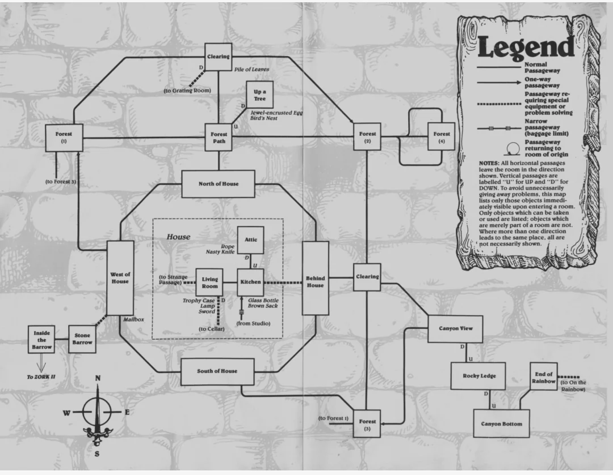
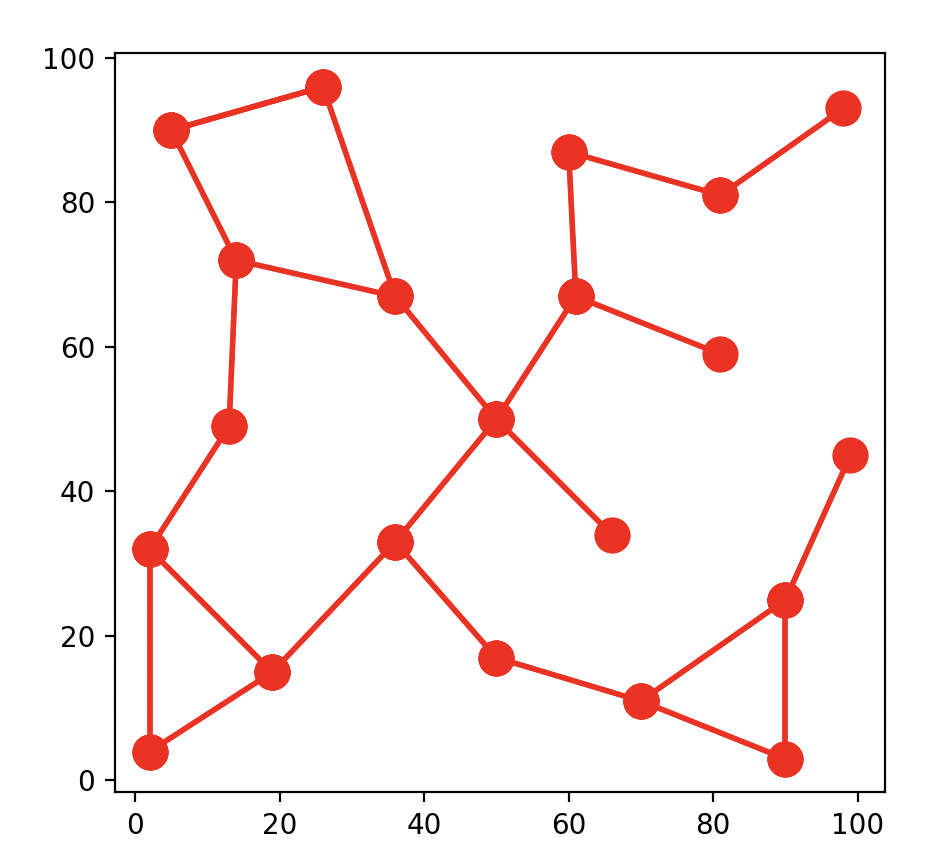

# _Minecraft_ and Chunking

This morning I had a dream that I was back in college, at the University of New Mexico, which I briefly attended back in 2000. Weirdly, I was aware that it was 2024, because of an exchange within the dream about which I don't recall anything else.

I was looking for a friend who I knew was attending that school; in the dream, it was Isaac H., but it was very similar to another recent dream I had where I was trying to find Sam W. at the same school. I knew, or at least suspected, that my friend did not want to see me and was avoiding me.

It was the last day of school; finals were taken, but, in some weird throwback to middle school and high school everyone had to attend for one more day. The last day of school was always... lonely. I felt a sense of freedom, of course, all those summer weeks for activities. But it felt empty, and I felt alone. I could feel my friends slipping away from me.

I bumped into some students as I traipsed around the campus. I saw a marijuana dispensary and thought, "huh, that's right, that's legal now," but I didn't particularly want to get high. It made me sad, just thinking about it. I found my way into a basement, and some kids blocked me at the door; there was a party under way, and they didn't feel very charitable. I laughed and told them I didn't drink, but I didn't have a problem buying my own beer anyway.

I woke up sad, feeling like I'd lost everything. Just one of those great big feelings of loss. Part of that is an [article I read](https://github.com/department-of-veterans-affairs/va.gov-cms/issues/15187), shared by my coworker [Tanner Heffner](https://www.heffner.dev) in the work Slack, that suggests that we web and web-adjacent developers are heading for _more_ pain, not less; that the job market is lousy but we're in the middle of a tech _bubble_, and that will burst sooner or later and things will get _worse_.

Another part of it is that I watched _The Super Mario Bros. Movie_ last night, at the behest of my child. It was a tremendously depressing experience. As was common for members of my generation, I was deeply enchanted by the original Nintendo games. I still remember an overwhelming sense of mystery and awe at seeing _Super Mario Bros. 3_ for the first time. I remember having a dream about _Super Mario Bros. 2_ before I ever played it, just from sheer anticipation. And the movie was just... generic. No point going deeper here; the movie never did.

I've been on vacation this week, and I'd greatly anticipated working on _Hornvale_. That hasn't gone well. It never does. Whenever I get time off, I think, "finally, now I have a chance to get some solid work done."

And what happens is I drive myself nuts. I begrudge every minute not spent on my project, so I put off exercising, eating, socializing, etc. I get increasingly aggravated with each new setback, because I envision a week of code streaming out the tips of my fingers and into `rustc` and emerging as a perfect unit of functionality that moves me inexorably toward the end-goal of a perfect game.

In reality, it's intensely frustrating, and I never accomplish much at all. And then it's Saturday, and I'm somehow _behind_ where I started the week, with nothing to show for it.

But possibly being in the midst of a bout with depression isn't really what this post is about; it's about _Minecraft_. In _Minecraft_, if you don't like where you are, you can just head in one direction or another, and things will change. If it's too steep to the west, turn to the south and go that way for a while. If you find an ocean that way, and don't have a boat on you and don't particularly want to paddle endlessly, turn to the east, or back to the west. There's an endless world to explore.

Of course, the world gets dangerous at night. And you're ultimately going to see the same few environments over and over again. That's not a knock against _Minecraft_, which is a great (albeit flawed) game. It's perhaps unavoidable. I'm not coming into this with a preconceived solution.

But dreams and _Minecraft_ are somewhat similar in that, no matter where you go, there's _something_ there.

I was startled to re-learn, reading through _[Internal Secrets of Infocom Games](https://eblong.com/infocom/other/Internal_Secrets_Ko_2019.pdf)_, that Infocom games were limited to a total of 256 objects (which includes rooms). _Zork I_ had 110 rooms and 60 takeable objects. And that game seemed quite large and expansive to me as a child.

But I also remember the keen frustration of stomping through the forests and being blocked by fallen trees. "Aw, c'mon," I thought (and perhaps said) as a 9- or 10-year-old. "I could find my way around that." I wanted to know what was on the other side. _Zork I_ was incredible enough, but I _knew_ that there were other mysteries, other places to explore.

_Minecraft_, for all its many numerous strengths, doesn't solve this problem. It presents an endless number of places to explore, but none of them are particularly interesting. You can't find bits of lore, like in _Skyrim_ or _Baldur's Gate III_ or most other RPGs, that deepen your immersion in and attachment to the world. (Admittedly, the absence of lore is itself interesting.)

And of course this is fitting into the pattern of roguelikes, most of which will procedurally generate dungeons that don't end up being very interesting. And I've [discussed this before](https://hornvale.github.io/book/004_dungeons/_introduction.html). But this isn't much of a project if I just complain about problems instead of trying to solve them interestingly, is it?

So let's state the problem clearly: I want _Hornvale_ to have an essentially infinite procedurally generated world, but I also want it to be _interesting_. How do we have both?

There are some related problems, though, and the first is, simply: "How do we have an essentially infinite procedurally generated world? Like, at all?"

So this article is about chunk loading, and how I'll handle that in _Hornvale_.

_Hornvale_ won't have graphics, but I anticipate that there will be a significant computational load for each "chunk"; there will be creatures going about their daily affairs, which will involve some understanding of and interaction with their surroundings: what season is it? what's the weather like? what can I gather from the ground? what squabbles am I involved in? what pressures do I face? my family? my tribe? what do the stars tell the shaman?

So, while I'm not necessarily concerned with all of the rays that need to be drawn to determine what is and is not visible, as I might be with a normal modern game engine, it's still important for me to restrict what is loaded at any given time. But we also need not to absolutely _minimize_ what is loaded; life _should_ go on, albeit a little slower, for chunks that the player is not currently exploring.

## On the Nature of a Chunk

A chunk in _Hornvale_ is not like one in most video games, even _Minecraft_. Rather than moving through a coherent, contiguous 2-D or 3-D space, we're transiting through a graph from node to node. We almost never actually _experience_ the edges, except as obstacles to overcome (doors, puzzles, etc). Our space does not actually need to be coherent.

Consequently, we lose a bit of mathematical consistency but gain a tremendous amount of flexibility. We can simply treat the world as an infinite graph where each node is a chunk, and each node is connected to at least one neighboring node by an edge.

I go into the specifics in more detail in [the Specification](https://github.com/hornvale/spec/), but I'll summarize the process here:

1. Create vertices in a unit Cartesian coordinate plane using a modified version of Bridson's algorithm.
2. Create a minimum spanning tree to connect the vertices using Prim's algorithm.
3. Create additional cycles to improve navigability using a simple random function.

That should lead to a graph that looks something like this:

We are left with regions and straight-line-ish connections between them, which we can use as the basis of our world, and of our chunking system.
