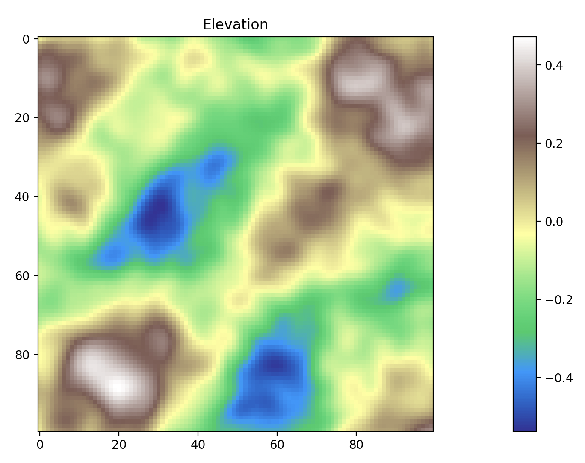

## Chunking III: Regional Variables and Generation

In [Part I](../008_chunking_i/), we figured out a way to generate a world map as a planar graph, using Poisson disk sampling and Bridson's algorithm to generate vertices, Prim's algorithm to create a minimum spanning tree connecting them, and injecting vertices semi-randomly to add cycles and improve navigability and nonlinearity.

In [Part II](../009_chunking_ii/), we devised a system, "Juice," that used some proxies for player engagement (proximity and recency) to determine how to allocate computing resources to regions; not just loading and unloading them as chunks, but making agents more active, battles more violent, and so forth.

In this part, we will begin to discuss how each region's attributes are generated and refined. This process begins with an initial variable generation and expanding the regions from vertices of a single coordinate into larger "chunks" of a game world.

There are certain "primary" variables that are useful in generating terrain, which we can generate with Simplex noise:

- **Elevation**: Multi-octave Simplex noise, combining layers of noise where each subsequent "octave" has a higher frequency but lower amplitude, can create a complex, layered terrain that simulates geological stratification.
- **Temperature**: Comparatively simple Simplex noise with amplitude varied along the north-south axis can simulate latitudinal effects on temperature. We can also apply a gradient decrease in temperature as elevation increases, simulating the lapse rate in the atmosphere, to create colder snow-capped peaks, alpine biomes, etc. And we can use smaller-scale noise functions to introduce local temperature variations that can create microclimates, such as cooler temperatures in deep valleys or unusually warm areas due to geothermal activity.
- **Moisture**: Moisture is significantly influenced by elevation, particularly through the orographic effect, where moist air rises over mountains, cools, and releases precipitation, leading to wetter conditions on windward sides and drier conditions (rain shadows) on leeward sides. This can be simulated by first determining prevailing wind directions (which could be derived from latitude or arbitrarily set for diversity) and then adjusting moisture levels based on whether terrain is on the windward or leeward side of elevation changes.

The practical implementation involves first generating our base Simplex noise maps for temperature and moisture, then applying adjustments based on the generated elevation map and the principles outlined above.

The process is as follows:

1. We first generate Simplex noise for elevation; elevation is affected less by other aspects, such as temperature and moisture, although we may revisit it. For increased realism, we generate multiple octaves of noise, which is to say that we first perturb a flat plane into some broad and simple wave, then revisit it at twice the level of detail but perturb by half as much, then revisit it again at twice the previous level of detail and perturb by half as much.

2. We then generate Simplex noise for temperature in such a way that we decrease as we head away from the equator.
