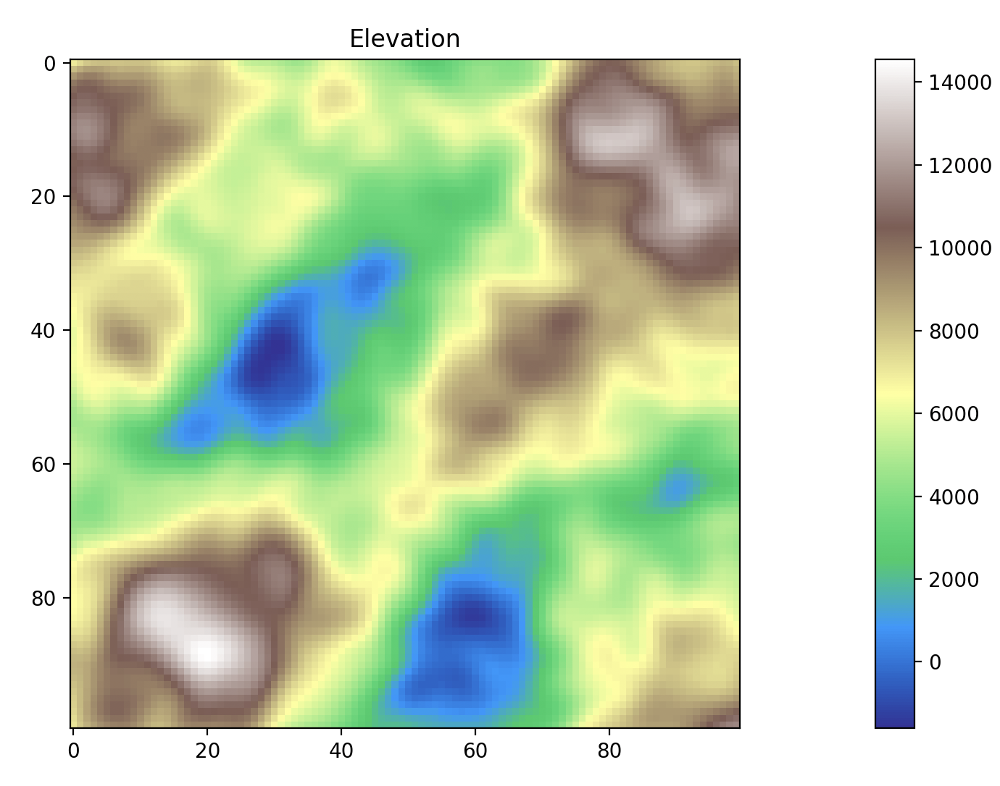

## Terrain Generation, Pt. I: Regional Variables and Generation

In [Chunking, Pt. I](../008_chunking_i/), we figured out a way to generate a world map as a planar graph, using Poisson disk sampling and Bridson's algorithm to generate vertices, Prim's algorithm to create a minimum spanning tree connecting them, and injecting vertices semi-randomly to add cycles and improve navigability and nonlinearity.

In [Chunking, Pt. II](../009_chunking_ii/), we devised a system, "Juice," that used some proxies for player engagement (proximity and recency) to determine how to allocate computing resources to regions; not just loading and unloading them as chunks, but making agents more active, battles more violent, and so forth.

In this article, the first in a series about terrain generation, we will begin to discuss how each region's physical attributes are generated and refined.

We first generate Simplex noise for elevation; elevation is affected less by other aspects, such as temperature and moisture, although we may revisit it. For increased realism, we generate multiple octaves of noise, which is to say that we first perturb a flat plane into some broad and simple wave, then revisit it at twice the level of detail but perturb by half as much, then revisit it again at twice the previous level of detail and perturb by half as much.

This may not seem like much, but we will go _deep_ on subsequent steps.
