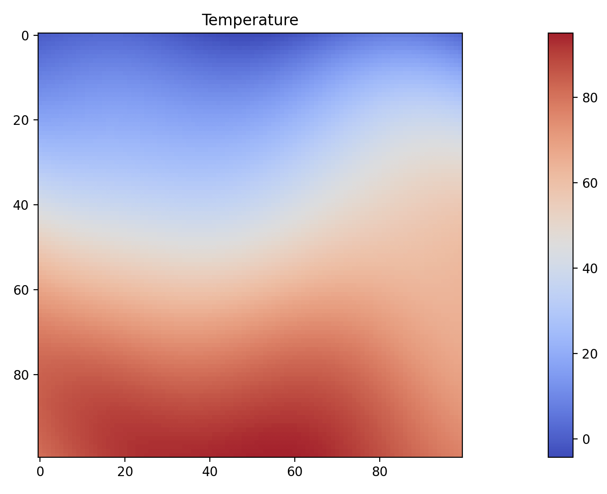

## Terrain Generation, Pt. II: Temperature

In [Terrain Generation, Pt. I](../010_terrain_i/), we generated an elevation map for our region. Elevation is, at least for our purposes, a rare "independent variable" for generating terrain. I'm not terribly concerned with erosion or the surface of the world being carved by waterflow. This is just a text adventure, after all. But elevation has numerous effects on other aspects of terrain generation.

The first of these is temperature. A base temperature map can be generated with Simplex noise composited with a latitudinal effect, so that regions closer to the poles are colder and regions closer to the equator are warmer.

I think that looks pretty nice. A little bit of random variation, in a reasonable range of temperatures (~-10º-90ºF) for a spring day across several biomes, from a harsh desert (Death Valley is about 80º in March) to an icy waste; many places on Earth get considerably colder than this, but I'm not particularly interested in simulating them.

We can then adjust that for elevation by calculating a lapse rate (the drop in temperature per unit increase in elevation change). Because this is a game, and we want to have a variety of biomes in short distances from one another, we can magnify this so that we end up with snow-capped peaks not terribly far away from a desert, but we can tweak this to shift the balance between dynamism and realism.

We can also determine highs and lows, and report how the temperature changes throughout the year, but these are not terribly interesting to look at, as they're mostly just changes in the numbers; the graph continues to look more-or-less the same.
